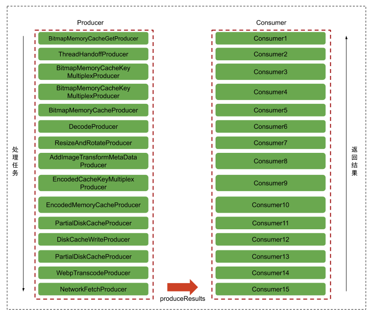

# Fresco庖丁解牛系列1——图片数据的获取

## DataSource/DataSubscriber机制
### 1. 什么是DataSource?
先看Fresco中DataSource的源码定义：
```Java
public interface DataSource<T> {

  //数据源是否关闭
  boolean isClosed();

  //获取异步请求结果
  T getResult();

  //是否有结果返回
  boolean hasResult();

  //是否有多个结果
  boolean hasMultipleResults();

  //请求是否结束
  boolean isFinished();

  //请求是否出错
  boolean hasFailed();

  //请求出错的原因
  Throwable getFailureCause();

  //请求进度，范围在[0,1]
  float getProgress();

  //关闭请求，释放资源
  boolean close();

  //为该数据源注册订阅者，当数据发生变化时该订阅者就会收到通知，并在指定的线程池里进行相应的更新操作
  void subscribe(DataSubscriber<T> dataSubscriber, Executor executor);
}
```
可以看出DataSource是一个类似于Java中Future的接口，用来封装一个异步任务的结果，但是相比Future，DataSource的方法要丰富得多。其中有个subscribe方法，显然这里运用到了观察者模式。

>观察者模式：定义对象间的一种一对多依赖关系，使得每当一个对象状态发生改变时，其相关依赖对象皆得到通知并被自动更新。观察者模式又叫做发布-订阅（Publish/Subscribe）模式、模型-视图（Model/View）模式、源-监听器（Source/Listener）模式或从属者（Dependents）模式。但是发布-订阅模式还是与普通的观察模式有一定的区别，详见：[观察者模式 vs 发布订阅模式](https://zhuanlan.zhihu.com/p/51357583)

### 2. 什么是DataSubscriber？
按照惯例，依然找到源码中的定义：
```java
public interface DataSubscriber<T> {

  //当dataSource中可以去除新的数据时调用
  void onNewResult(@Nonnull DataSource<T> dataSource);

  //当imagepipeline出错时调用
  void onFailure(@Nonnull DataSource<T> dataSource);

  //当请求被取消时调用
  void onCancellation(@Nonnull DataSource<T> dataSource);

  //当进度更新时调用
  void onProgressUpdate(@Nonnull DataSource<T> dataSource);
}
```
DataSubscriber就是DataSource的观察者，用来获取DataSource中的结果数据并在数据发生变化时能够实时处理。Fresco还提供了两个实现了DataSubscriber的抽象类BaseDataSubscriber和BaseBitmapDataSubscriber。其中BaseDataSubscriber确保了数据不再使用之后DataSource及时关闭，防止内存泄漏；BaseBitmapDataSubscriber则是在BaseDataSubscriber的基础上方便调用者直接拿到bitmap并进行处理。

### 3. DataSource和DataSubscriber机制是如何工作的？
在了解它们的工作机制之前，需要知道DataSource应该如何生成？其实我们在使用Fresco加载图片时使用
`simpleDraweeView.setImageURI(url);`即可，并不需要关心DataSource，这是因为底层都有相应的默认实现。我们可以通过追踪SimpleDraweeView的setImageURI看看底层默认是如何生成DataSource的：
```
[SimpleDraweeView]setImageURI -> [DraweeView]setController -> [DraweeHolder]setController ->
[DraweeHolder]attachController -> [AbstractDraweeController]onAttach -> [AbstractDraweeController]submitRequest
```

在AbstractDraweeController的`submitRequest`里看到了我们刚刚介绍的DataSource和DataSubscriber：
```java
protected void submitRequest() {
  ......
  mDataSource = getDataSource();
  ......
  final DataSubscriber<T> dataSubscriber =
      new BaseDataSubscriber<T>() {
        @Override
        public void onNewResultImpl(DataSource<T> dataSource) {
          // isFinished must be obtained before image, otherwise we might set intermediate result
          // as final image.
          boolean isFinished = dataSource.isFinished();
          boolean hasMultipleResults = dataSource.hasMultipleResults();
          float progress = dataSource.getProgress();
          T image = dataSource.getResult();
          if (image != null) {
            onNewResultInternal(
                id, dataSource, image, progress, isFinished, wasImmediate, hasMultipleResults);
          } else if (isFinished) {
            onFailureInternal(id, dataSource, new NullPointerException(), /* isFinished */ true);
          }
        }

        @Override
        public void onFailureImpl(DataSource<T> dataSource) {
          onFailureInternal(id, dataSource, dataSource.getFailureCause(), /* isFinished */ true);
        }

        @Override
        public void onProgressUpdate(DataSource<T> dataSource) {
          boolean isFinished = dataSource.isFinished();
          float progress = dataSource.getProgress();
          onProgressUpdateInternal(id, dataSource, progress, isFinished);
        }
      };
  mDataSource.subscribe(dataSubscriber, mUiThreadImmediateExecutor);
}
```
所以dataSource是通过`getDataSource`方法生成的，并且绑定了AbstractDraweeController自定义实现的DataSubscriber。由于AbstractDraweeController中的`getDataSource`方法是一个抽象类，所以具体实现需要在它的子类PipelineDraweeController中查看：
```Java
protected DataSource<CloseableReference<CloseableImage>> getDataSource() {
    ......
    DataSource<CloseableReference<CloseableImage>> result = mDataSourceSupplier.get();
    ......
    return result;
  }
```
mDataSourceSupplier是PipelineDraweeController的成员变量，是`Supplier<DataSource<CloseableReference<CloseableImage>>>`类型，所以mDataSourceSupplier用来提供一个结果类型为CloseableReference<CloseableImage>>的DataSource。mDataSourceSupplier在PipelineDraweeController的initialize方法进行初始化，而PipelineDraweeController是由PipelineDraweeControllerBuilder初始化得到的：
```Java
protected PipelineDraweeController obtainController() {
      ......
      DraweeController oldController = getOldController();
      PipelineDraweeController controller;
      final String controllerId = generateUniqueControllerId();
      //如果已经有PipelineDraweeController，则进行复用，否则构建新的PipelineDraweeController。
      if (oldController instanceof PipelineDraweeController) {
        controller = (PipelineDraweeController) oldController;
      } else {
        controller = mPipelineDraweeControllerFactory.newController();
      }
      //使用新的数据源提供对象、id、calleerContext等初始化Controller
      controller.initialize(
          obtainDataSourceSupplier(controller, controllerId),
          controllerId,
          getCacheKey(),
          getCallerContext(),
          mCustomDrawableFactories,
          mImageOriginListener);
      controller.initializePerformanceMonitoring(mImagePerfDataListener, this);
      return controller;
      .......
}
```
`obtainDataSourceSupplier`方法返回的就是一个`Supplier<DataSource<CloseableReference<CloseableImage>>>`类型的对象：

```Java
protected Supplier<DataSource<IMAGE>> obtainDataSourceSupplier(
      final DraweeController controller, final String controllerId) {
    if (mDataSourceSupplier != null) {
      return mDataSourceSupplier;
    }

    Supplier<DataSource<IMAGE>> supplier = null;

    // final image supplier;
    if (mImageRequest != null) {
      supplier = getDataSourceSupplierForRequest(controller, controllerId, mImageRequest);
    } else if (mMultiImageRequests != null) {
      supplier =
          getFirstAvailableDataSourceSupplier(
              controller, controllerId, mMultiImageRequests, mTryCacheOnlyFirst);
    }

    ......

    return supplier;
}
```

AbstractDraweeControllerBuilder的`getDataSourceSupplierForRequest`方法：
```Java
protected Supplier<DataSource<IMAGE>> getDataSourceSupplierForRequest(
    final DraweeController controller, String controllerId, REQUEST imageRequest) {
  return getDataSourceSupplierForRequest(
      controller, controllerId, imageRequest, CacheLevel.FULL_FETCH);
}

protected Supplier<DataSource<IMAGE>> getDataSourceSupplierForRequest(
      final DraweeController controller,
      final String controllerId,
      final REQUEST imageRequest,
      final CacheLevel cacheLevel) {
    final Object callerContext = getCallerContext();
    return new Supplier<DataSource<IMAGE>>() {
      @Override
      public DataSource<IMAGE> get() {
        return getDataSourceForRequest(
            controller, controllerId, imageRequest, callerContext, cacheLevel);
      }

      ......
    };
}
```

PipelineDraweeControllerBuilder的`getDataSourceForRequest`方法：
```Java
protected DataSource<CloseableReference<CloseableImage>> getDataSourceForRequest(
            DraweeController controller,
            String controllerId,
            ImageRequest imageRequest,
            Object callerContext,
            AbstractDraweeControllerBuilder.CacheLevel cacheLevel) {
    return mImagePipeline.fetchDecodedImage(
           imageRequest,
           callerContext,
           convertCacheLevelToRequestLevel(cacheLevel),
           getRequestListener(controller),
           controllerId);
    }
}
```

ImagePipeline的`fetchDecodedImage`方法：
```Java
public DataSource<CloseableReference<CloseableImage>> fetchDecodedImage(
      ImageRequest imageRequest,
      Object callerContext,
      ImageRequest.RequestLevel lowestPermittedRequestLevelOnSubmit,
      @Nullable RequestListener requestListener,
      @Nullable String uiComponentId) {
      ......
      //1. 获取Producer序列，为DataSource提供不同的数据输入管道。
      Producer<CloseableReference<CloseableImage>> producerSequence =
          mProducerSequenceFactory.getDecodedImageProducerSequence(imageRequest);
      //2. 调用submitFetchRequest()方法生成DataSource。
      return submitFetchRequest(
          producerSequence,
          imageRequest,
          lowestPermittedRequestLevelOnSubmit,
          callerContext,
          requestListener,
          uiComponentId);
      ......
}
```

通过这样一路下来发现Fresco默认通过ImagePipeline的`fetchDecodedImage`方法创建DataSource，同时还创建了一个Producer序列，因为DataSource代表的数据需要由Producer执行生成。这里暂不展开分析，后续再单独介绍。直接看ImagePipeline的`submitFetchRequest`方法：

```Java
private <T> DataSource<CloseableReference<T>> submitFetchRequest(
      Producer<CloseableReference<T>> producerSequence,
      ImageRequest imageRequest,
      ImageRequest.RequestLevel lowestPermittedRequestLevelOnSubmit,
      Object callerContext,
      @Nullable RequestListener requestListener,
      @Nullable String uiComponentId) {
      ......
      return CloseableProducerToDataSourceAdapter.create(
          producerSequence, settableProducerContext, requestListener2);
      ......
}
```
显然CloseableProducerToDataSourceAdapter也是DataSource类型，并可以通过调用自己的create方法生成实例对象。

```Java
public class CloseableProducerToDataSourceAdapter<T>
    extends AbstractProducerToDataSourceAdapter<CloseableReference<T>> {

  public static <T> DataSource<CloseableReference<T>> create(
      Producer<CloseableReference<T>> producer,
      SettableProducerContext settableProducerContext,
      RequestListener2 listener) {
    ......
    CloseableProducerToDataSourceAdapter<T> result =
        new CloseableProducerToDataSourceAdapter<T>(producer, settableProducerContext, listener);
    ......
    return result;
  }

  private CloseableProducerToDataSourceAdapter(
      Producer<CloseableReference<T>> producer,
      SettableProducerContext settableProducerContext,
      RequestListener2 listener) {
    super(producer, settableProducerContext, listener);
  }

  ......
}
```
CloseableProducerToDataSourceAdapter的直接父类是AbstractProducerToDataSourceAdapter，其构造方法也是直接调用父类的方法：

```Java
public abstract class AbstractProducerToDataSourceAdapter<T> extends AbstractDataSource<T>
    implements HasImageRequest {

  ......

  protected AbstractProducerToDataSourceAdapter(
      Producer<T> producer,
      SettableProducerContext settableProducerContext,
      RequestListener2 requestListener) {
    ......
    producer.produceResults(createConsumer(), settableProducerContext);
    ......
  }

  // 最终的结果会被这个方法所创建的Consumer消费
  private Consumer<T> createConsumer() {
    return new BaseConsumer<T>() {
      @Override
      protected void onNewResultImpl(@Nullable T newResult, @Status int status) {
        AbstractProducerToDataSourceAdapter.this.onNewResultImpl(newResult, status);
      }

      @Override
      protected void onFailureImpl(Throwable throwable) {
        AbstractProducerToDataSourceAdapter.this.onFailureImpl(throwable);
      }

      @Override
      protected void onCancellationImpl() {
        AbstractProducerToDataSourceAdapter.this.onCancellationImpl();
      }

      @Override
      protected void onProgressUpdateImpl(float progress) {
        AbstractProducerToDataSourceAdapter.this.setProgress(progress);
      }
    };
  }
  ......
  protected void onNewResultImpl(@Nullable T result, int status) {
    boolean isLast = BaseConsumer.isLast(status);
    //调用AbstactDataSource的setResult方法
    if (super.setResult(result, isLast)) {
      if (isLast) {
        mRequestListener.onRequestSuccess(mSettableProducerContext);
      }
    }
  }
  ......
}
```
AbstractProducerToDataSourceAdapter的构造方法其实做了两件事：一是创建一个Consumer，二是启动Producer生产数据，数据结果最终也交由这个创建出来的Consumer进行消费。

由于Producer在处理任务时是按照一定的序列依次执行的，当上一个Producer执行完毕后，下一个Producer继续执行，同时将上一个Producer传递下来的Consumer进行相应的包装。所以，当所有的Producer都完成自己的任务后，结果就会按照Producer传递的相反方向层层返回到最上层的Consumer回调中。而最上层的这个Consumer正是AbstractProducerToDataSourceAdapter的createConsumer方法创建的Consumer。

AbstractProducerToDataSourceAdapter的直接父类是AbstractDataSource：
```java
public abstract class AbstractDataSource<T> implements DataSource<T> {
  ......
  private @Nullable T mResult = null;
  private final ConcurrentLinkedQueue<Pair<DataSubscriber<T>, Executor>> mSubscribers;

  ......

  @Override
  public void subscribe(final DataSubscriber<T> dataSubscriber, final Executor executor) {
    ......
    if (mDataSourceStatus == DataSourceStatus.IN_PROGRESS) {
        mSubscribers.add(Pair.create(dataSubscriber, executor));
    }
    shouldNotify = hasResult() || isFinished() || wasCancelled();
    ......
    if (shouldNotify) {
      notifyDataSubscriber(dataSubscriber, executor, hasFailed(), wasCancelled());
    }
  }

  ......

  protected boolean setResult(@Nullable T value, boolean isLast) {
    boolean result = setResultInternal(value, isLast);
    if (result) {
      notifyDataSubscribers();
    }
    return result;
  }

  private void notifyDataSubscribers() {
    final boolean isFailure = hasFailed();
    final boolean isCancellation = wasCancelled();
    for (Pair<DataSubscriber<T>, Executor> pair : mSubscribers) {
      notifyDataSubscriber(pair.first, pair.second, isFailure, isCancellation);
    }
  }

  protected void notifyDataSubscriber(
      final DataSubscriber<T> dataSubscriber,
      final Executor executor,
      final boolean isFailure,
      final boolean isCancellation) {
    Runnable runnable =
        new Runnable() {
          @Override
          public void run() {
            if (isFailure) {
              dataSubscriber.onFailure(AbstractDataSource.this);
            } else if (isCancellation) {
              dataSubscriber.onCancellation(AbstractDataSource.this);
            } else {
              dataSubscriber.onNewResult(AbstractDataSource.this);
            }
          }
        };
    ......
    executor.execute(runnable);
  }
  ......
}
```
AbstractDataSource的实例变量mResult用来保存结果，mSubscribers变量则用来保存所有通过subscribe方法注册的订阅者列表。例如如果得到了最终的结果，那么就会执行setResult方法，并及时通知所有已经注册了的数据订阅者，执行相应的回调方法。通过AbstractDataSource我们可以更清楚地看到DataSource和DataSubscriber机制是如何工作的。

### 4. 如何使用DataSource和DataSourceSubscriber
清楚了Fresco内部的DataSource和DataSubscriber的工作机制之后，我们就可以直接使用它们来获取图片数据并进行处理，例如：
```Java
DataSource<CloseableReference<T>> dataSource = ......;
DataSubscriber<CloseableReference<T>> dataSubscriber =
    new BaseDataSubscriber<CloseableReference<T>>() {
      @Override
      protected void onNewResultImpl(
          DataSource<CloseableReference<T>> dataSource) {
        if (!dataSource.isFinished()) {
          // 如果对中间数据不感兴趣，可以直接返回
          return;
        }
        //从dataSource中取出数据，但是这个数据被封装在了CloseableReference中，真正的数据还需要通过CloseableReference的get方法得到
        CloseableReference<T> ref = dataSource.getResult();
        if (ref != null) {
          try {
            T result = ref.get();
            ... // 对结果数据进行处理
          } finally {
            CloseableReference.closeSafely(ref);
          }
        }
      }

      @Override
      protected void onFailureImpl(DataSource<CloseableReference<T>> dataSource) {
        Throwable t = dataSource.getFailureCause();
        ... // 对异常情况进行处理
      }
    };

dataSource.subscribe(dataSubscriber, executor);
```
如果想直接取得bitmap并进行相应处理，那么这样实现即可：
```Java
dataSource.subscribe(new BaseBitmapDataSubscriber() {
    @Override
    public void onNewResultImpl(@Nullable Bitmap bitmap) {
      // 使用bitmap，方法结束后会自动回收该bitmap
    }

    @Override
    public void onFailureImpl(DataSource dataSource) {
    }
  },
  executor);
```
DataSource既可以通过ImagePipeline的fetchDecodeImage生成，也可以通过ImagePipeline的fetchEncodedImage生成，前者中的数据是未解码图片，而后者中的数据则是图片解码后的bitmap。

还记得在ImagePipeline的`fetchDecodeImage`方法中还生成了一个Producer序列，所以是时候了解Fresco中的Producer/Consumer机制了。

## Producer/Consumer机制

### 1. 什么是Producer和Consumer？
```Java
public interface Producer<T> {
   //执行任务，得到的结果由Consumer消费
  void produceResults(Consumer<T> consumer, ProducerContext context);
}

public interface Consumer<T> {
  ......

  /** 当得到producer生成的结果时执行此方法，其中status参数是对这个结果的标识（如是否是最终结果、是否是占位图等 */
  void onNewResult(T newResult, @Status int status);

  /** 当producer因为异常意外终止时执行此方法 */
  void onFailure(Throwable t);

  /** 当producer任务被取消时执行此方法 */
  void onCancellation();

  /** 当更新Producer执行进度时执行此方法 */
  void onProgressUpdate(float progress);
}
```
一个完整的图片加载是由许多个子任务组成的，包括获取图片的原始数据、图片转换、解码、磁盘缓存、内存缓存等等。Fresco因此设计了Producer/Consumer机制。Producer就代表一个任务，每一个Producer都有一个配对的Consumer，来消费任务执行结束后产生的结果。Producer有很多具体实现，大多对应于某个具体的任务。可根据任务类型的不同，可将主要的Producer实现类分为以下几类：

**本地数据获取类Producer，这类Producer负责从本地获取数据**

- LocalFetchProducer：实现了Producer接口，所有本地数据Producer获取的基类。
- LocalAssetFetchProducer：继承于LocalFetchProducer，通过AssetManager获取ImageRequest对象的输入流及对象字节码长度，将它转换为EncodedImage；
- LocalContentUriFetchProducer 继承于LocalFetchProducer，若Uri指向联系人，则获取联系人头像；若指向相册图片，则会根据是否传入ResizeOption进行一定缩放（这里不是完全按ResizeOption缩放）；若止这两个条件都不满足，则直接调用ContentResolver的函数openInputStream(Uri uri)获取输入流并转化为EncodedImage；
- LocalFileFetchProducer 继承于LocalFetchProducer，直接通过指定文件获取输入流，从而转化为EncodedImage；
- LocalResourceFetchProducer 继承于LocalFetchProducer，通过Resources的函数openRawResources获取输入流，从而转化为EncodedImage。
- LocalExifThumbnailProducer 没有继承于LocalFetchProducer，可以获取Exif图像的Producer；
- LocalVideoThumbnailProducer 没有继承于LocalFetchProducer，可以获取视频缩略图的Producer。

**网络数据获取类Producer，这类Producer负责从网络获取数据**

- NetworkFetchProducer：实现了Producer接口，从网络上获取图片数据。


**缓存数据获取类Producer，这类Producer负责从缓存中获取数据**

- BitmapMemoryCacheGetProducer 它是一个Immutable的Producer，仅用于包装后续Producer；
- BitmapMemoryCacheProducer 在已解码的内存缓存中获取数据；若未找到，则在nextProducer中获取数据，并在获取到数据的同时将其缓存；
- BitmapMemoryCacheKeyMultiplexProducer 是MultiplexProducer的子类，nextProducer为BitmapMemoryCacheProducer，将多个拥有相同已解码内存缓存键的ImageRequest进行“合并”，若缓存命中，它们都会获取到该数据；
- PostprocessedBitmapMemoryCacheProducer 在已解码的内存缓存中寻找PostProcessor处理过的图片。它的nextProducer都是PostProcessorProducer，因为如果没有获取到被PostProcess的缓存，就需要对获取的图片进行PostProcess。；若未找到，则在nextProducer中获取数据；
- EncodedMemoryCacheProducer 在未解码的内存缓存中寻找数据，如果找到则返回，使用结束后释放资源；若未找到，则在nextProducer中获取数据，并在获取到数据的同时将其缓存；
- EncodedCacheKeyMultiplexProducer 是MultiplexProducer的子类，nextProducer为EncodedMemoryCacheProducer，将多个拥有相同未解码内存缓存键的ImageRequest进行“合并”，若缓存命中，它们都会获取到该数据；
DiskCacheProducer 在文件内存缓存中获取数据；若未找到，则在nextProducer中获取数据，并在获取到数据的同时将其缓存

**功能类Producer，这类Producer在初始化的时候会传入一个nextProducer，它们会对nextProducer产生的结果进行处理**

- MultiplexProducer 将多个拥有相同CacheKey的ImageRequest进行“合并”，让他们从都从nextProducer中获取数据；
ThreadHandoffProducer 将nextProducer的produceResult方法放在后台线程中执行（线程池容量为1）；
- SwallowResultProducer 将nextProducer的获取的数据“吞”掉，会在Consumer的onNewResult中传入null值；
- ResizeAndRotateProducer 将nextProducer产生的EncodedImage根据EXIF的旋转、缩放属性进行变换（如果对象不是JPEG格式图像，则不会发生变换）；
- PostProcessorProducer 将nextProducer产生的EncodedImage根据PostProcessor进行修改，关于PostProcessor详见修改图片；
- DecodeProducer 将nextProducer产生的EncodedImage解码。解码在后台线程中执行，可以在ImagePipelineConfig中通过setExecutorSupplier来设置线程池数量，默认为最大可用的处理器数；
- WebpTranscodeProducer 若nextProducer产生的EncodedImage为WebP格式，则将其解码成DecodeProducer能够处理的EncodedImage。解码在后代进程中进行。


### 2. Producer序列的生成
所有的Producer都可以像Java的IO流那样，一层嵌套一层，最终只得到一个结果。这是一个非常巧妙的设计，因为这样就可以根据需要选择合适的Producer组合成相应的Producer序列，从而为DataSource提供不同的数据管道。ProducerSequenceFactory的`getDecodedImageProducerSequence`方法可以根据给定的图片请求ImageRequest生成了一个Producer序列，实际上ImagePipeline的`getDecodedImageProducerSequence`方法里调用的也是这个方法。

```Java
public Producer<CloseableReference<CloseableImage>> getDecodedImageProducerSequence(
    ImageRequest imageRequest) {
  ......
  //获得一个普通的图片加载事件序列
  Producer<CloseableReference<CloseableImage>> pipelineSequence =
      getBasicDecodedImageSequence(imageRequest);
  //对解码得到的bitmap再进行一次处理
  if (imageRequest.getPostprocessor() != null) {
    pipelineSequence = getPostprocessorSequence(pipelineSequence);
  }
  //Android的显示系统使用OpenGL，bitmap在底层表现为OpenGL的纹理，因此在bitmap第一次被展示的时候，bitmap会被首先上传到GPU上。在Android 7.0上，图片加载代码可以调用 prepareToDraw 在需要的时候提前触发Bitmap上传动作；这种方式可以使Bitmap在RenderThread空闲的时候提前完成。
  if (mUseBitmapPrepareToDraw) {
    pipelineSequence = getBitmapPrepareSequence(pipelineSequence);
  }
  ......
  return pipelineSequence;
}

private Producer<CloseableReference<CloseableImage>> getBasicDecodedImageSequence(
      ImageRequest imageRequest) {
      ......
      Uri uri = imageRequest.getSourceUri();

      //根据请求的图片数据源类型，生成相应的Producer序列
      switch (imageRequest.getSourceUriType()) {
        case SOURCE_TYPE_NETWORK:
          return getNetworkFetchSequence();
        case SOURCE_TYPE_LOCAL_VIDEO_FILE:
          return getLocalVideoFileFetchSequence();
        case SOURCE_TYPE_LOCAL_IMAGE_FILE:
          return getLocalImageFileFetchSequence();
        case SOURCE_TYPE_LOCAL_CONTENT:
          if (MediaUtils.isVideo(mContentResolver.getType(uri))) {
            return getLocalVideoFileFetchSequence();
          }
          return getLocalContentUriFetchSequence();
        case SOURCE_TYPE_LOCAL_ASSET:
          return getLocalAssetFetchSequence();
        case SOURCE_TYPE_LOCAL_RESOURCE:
          return getLocalResourceFetchSequence();
        case SOURCE_TYPE_QUALIFIED_RESOURCE:
          return getQualifiedResourceFetchSequence();
        case SOURCE_TYPE_DATA:
          return getDataFetchSequence();
        default:
          throw new IllegalArgumentException(
              "Unsupported uri scheme! Uri is: " + getShortenedUriString(uri));
      }
      ......
  }
```
可见，ProducerSequenceFactory可以根据请求的图片数据源类型生成不同的Producer序列。例如，如果要从网络获取图片，其Producer序列需通过`getNetworkFetchSequence`方法生成，具体为：


