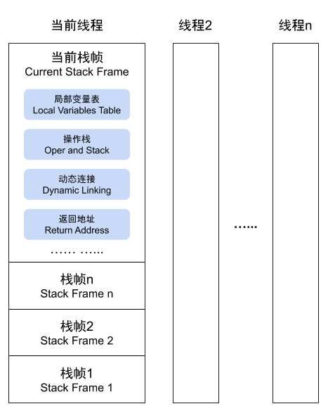

# 探究Java虚拟机如何执行程序——虚拟机字节码执行引擎

执行引擎是JVM核心的组成部分。“虚拟机”是一个相对于“物理机”的概念，这两种机器都有代码执行的能力，其区别是物理机的执行引擎是直接建立在处理器、缓存、指令集和操作系统层面上的，而虚拟机的执行引擎则是由软件自行实现的，因此可以不受物理条件限制，执行那些不被硬件直接支持的指令集格式。

所有的JVM的执行引擎输入、输出都是一致的：输入的是字节码二进制流，处理过程是字节码解析执行的等效过程，输出的是执行结果。

## 1. 运行时栈帧结构
JVM以方法作为最基本的执行单元，“栈帧”则是用于支持虚拟机进行方法调用和方法执行背后的数据结构，它也是虚拟机运行时数据区中的虚拟机栈的栈元素。栈帧存储了方法的局部变量表、操作数栈、动态连接和方法返回地址等信息。每一个方法从调用开始到执行结束的过程，都对应着一个栈帧在虚拟机栈里面从入栈到出栈的过程。

在编译Java程序源码时，栈帧中需要多大的局部变量表，需要多深的操作数栈就已经分析计算出来，并且写入到方法表的Code属性中。换言之，一个栈帧需要分配多少内存，并不会受到程序运行期变量数据的影响，而仅仅取决于程序源码和具体的虚拟机实现的栈内存布局形式。

一个线程中的方法调用链可能会很长，以Java程序的角度来看，同一时刻、同一条线程里，在调用堆栈的所有方法都同时处于执行状态。而对于执行引擎来说，在活动线程中，只有位于栈顶的方法才是在运行的，只有位于栈顶的栈帧才是生效的，其被称为“当前栈帧”，与这个栈帧所关联的方法被称为“当前方法”。执行引擎所运行的所有字节码指令都只针对当前栈帧进行操作，在概念模型上，典型的栈帧结构如下所示：



### 1.1 局部变量表
局部变量表是一组变量值的存储空间，用于存放方法参数和方法内部定义的局部变量。在Java程序被编译为Class文件时，就在方法的Code属性的max_locals数据项中确定了该方法所需分配的局部变量表的最大容量。

局部变量表的容量以变量槽（Variable Slot）为最小单位，《Java虚拟机规范》并没有明确指出一个变量槽应占用的内存空间大小，只是很有导向性地说每个变量槽都应该能存放一个boolean、byte、char、short、int、float、reference或returenAddress类型的数据。这8种数据类型，都可以使用32位或更小的物理内存来存储，但是这种描述与明确指出“每个变量槽应占用32位长度的内存空间”是由本质差别的，它允许变量槽的长度可以随着处理器、操作系统或虚拟机实现的不同而发生变化。

对于64位的数据类型，JVM会以高位对齐的方式为其分配连续两个连续的变量槽空间。Java语言中明确的64位的数据类型只有long和double两种。由于局部变量表是建立在线程堆栈中的，属于线程私有的数据，无论读写两个连续的变量槽是否为原子操作，都不会引起数据竞争和线程安全问题。
JVM通过索引定位的方式使用局部变量表，索引值的范围是从0开始至局部变量表最大的变量槽数量。如果访问的是32位数据类型的变量，索引N就代表了使用第N个变量槽，如果访问的是64位数据类型，则说明会同时使用第N和N+1两个变量槽。

当一个方法被调用时，JVM会使用局部变量表来完成参数值到参数变量列表的传递过程，即实参到形参的传递。如果执行的是实例方法，那么局部变量表中第0位索引的变量槽默认是用于传递方法所属对象实例的引用，在方法中可以通过关键字“this”来访问到这个隐含的参数。其余参数则按照参数表顺序排列，占用从1开始的局部变量槽，参数表分配完毕后，再根据方法体内部定义的变量顺序和作用域 分配其余的变量槽。

为了尽可能节省栈帧耗用的内存空间，局部变量表中的变量槽是可以重用的，方法体中定义的变量，其作用域不一定覆盖整个方法体，如果当前字节码PC计数器的值已经超出了某个变量的作用域，那这个变量对应的变量槽就可以交给其他变量来重用。

另外，不同于类变量，局部变量没有“准备阶段”。如果一个局部变量定义了但没有赋初始值，那么它是完全不能使用的。所以不要认为Java中任何情况下都存在诸如整型变量默认为0、布尔型变量默认为false等这样的默认值规则。

### 1.2 操作数栈

操作数栈（Operand Stack）也常被称为操作栈，它是一个后入先出栈。同局部变量表一样，操作数栈的最大深度也在编译时被写入到Code属性的max_stacks数据项之中。操作数栈的每一个元素都可以是包括long和double在内的任意java数据类型。32位数据类型所占的栈容量为1，64位数据类型所占的栈容量为2。javac编译器的数据流分析工作保证了在方法执行的任何时候，操作数栈的深度都不会超过在max_stacks数据项中设定的最大值。

当一个方法刚刚开始执行的时候，这个方法的操作数栈是空的，在方法的执行过程中，会有各种字节码指令往操作数栈写入和提取内容，也就是出栈和入栈操作。

在概念模型中，两个不同栈帧作为不同方法的虚拟机栈的元素，是完全相互独立的。但是在大多数虚拟机的实现里都会进行一些优化处理，令两个栈帧出现一部分重叠。让下面栈帧的部分操作数栈与上面栈帧的部分局部变量表重叠在一起，这样做不仅节约了一些空间，更重要的是在进行方法调用时可以直接共用一部分数据，无须进行额外的参数复制传递了，重叠的过程如下所示：


Java虚拟机的解释执行引擎被称为“基于栈的执行引擎”，里面的“栈”就是操作数栈。

### 1.3 动态连接
每个栈帧都包含一个指向运行时常量池中该栈帧所属方法的引用，持有这个引用是为了支持方法调用过程中的动态连接。Class文件的常量池中存在大量的符号引用，字节码中的方法调用指令就以常量池里指向方法的符号引用作为参数。这些符号引用一部分会在类加载阶段或者第一次使用的时候就被转化为直接引用，这种转化被称为静态解析。另外一部分将在每一次运行期间都转化为直接引用，这部分就被称为动态连接。

### 1.4 方法返回地址
当一个方法开始执行后，只有两种方式退出这个方法。第一种方式是执行引擎遇到任意一个方法返回的字节码指令，这时候可能会由返回值传递给上层的方法调用者，方法是否有返回值以及返回值类型将根据遇到何种方法返回指令来决定，这种退出方法的方式称为“正常调用完成”。

另外一种退出方式是在方法执行的过程中遇到了异常，并且这个异常没有在方法体内得到妥善处理。无论是JVM内部产生的异常，还是代码中使用athrow字节码指令产生的异常，只要在本方法的异常表中没有搜索到匹配的异常处理器，就会导致方法退出，这种退出方法的方式称为“异常调用完成”。一个方法使用异常完成出口的方式退出，是不会给它的上层调用者提供任何返回值的。

无论采用何种退出方式，在方法退出之后，都必须返回到最初方法被调用时的位置，程序才能继续执行，方法返回时可能需要在栈帧中保存一些信息，用来帮助恢复它的上层主调方法的执行状态。一般来说，方法正常退出时，主调方法的PC计数器的值就可以作为返回地址，栈帧中很可能就会保存这个计数器值。而方法异常退出时，返回地址是要通过异常处理器表来确定的，栈帧中就一般不会保存这部分信息。

方法退出的过程实际上等同于把当前栈帧出栈，因此退出时可能执行的操作有：恢复上层方法的局部变量表和操作数栈，把返回值（如果有的话）压入调用者栈帧的操作数栈中，调整PC计数器的值以指向方法调用指令后面的一条指令等。

### 1.5 附加信息
《Java虚拟机规范》允许虚拟机实现增加一些规范里没有描述的信息到栈帧中，例如与调试、性能收集相关的信息，这部分信息完全取决于具体的虚拟机实现。

## 2. 方法调用
方法调用并不等同于方法中的代码被执行，方法调用阶段唯一的任务就是确定被调用的方法的版本（即调用哪一个方法），暂时还未涉及方法内部的具体运行过程。

### 2.1 解析
所有方法调用的目标方法在Class文件里面都是一个常量池中的符号引用，在类加载的解析阶段，会将其中的一部分符号引用转化为直接引用，这种解析能够成立的前提是：方法在程序真正运行之前就有一个可确定的调用版本，并且这个方法的调用版本在运行期间是不可改变的。换句话说，调用目标在程序代码写好、编译器进行编译那一刻就已经确定下来。这类方法的调用被称为解析。

在Java语言中符合“编译器可知，运行期不可变”这个要求的方法，主要有静态方法和私有方法两大类，前者和类型直接关联，后者在外部不可被访问，这两种方法各自的特点决定了它们都不可能通过继承或别的方式重写出其他版本，因此它们都适合在类加载阶段进行解析。

调用不同类型的方法，字节码指令集里设计了不同的指令。JVM支持以下5种方法调用字节码指令，分别是：
- invokestatic：用于调用静态方法
- invokespecial：用于调用实例构造器<init>()方法、私有方法和父类中的方法
- invokevirtual：用于调用所有的虚方法
- invokeinterface：用于调用接口方法，会在运行时再确定一个实现该接口的对象
- invokedynamic：现在运行时动态解析处调用点限定符所引用的方法，然后再执行该方法。前面4条调用指令，分派逻辑都固化在JVM内部，而invokedynamic指令的分派逻辑是由用户设定的引导方法来决定的。

只要能被invokestatic和invokespecial指令调用的方法，都可以在解析阶段中确定唯一的调用版本，Java语言里符合这个条件的方法共有**静态方法**、**私有方法**、**实例构造器**、**父类方法**4种，再加上被final修饰的方法（尽管它使用invokevirtual指令调用），这5种方法调用会在类加载的时候就可以把符号引用解析为该方法的直接引用。这些方法统称为“非虚方法”，与之相反，其他方法就被称为“虚方法”。

### 2.2 分派
解析调用一定是一个静态过程，在编译器就完全确定，在类加载的解析阶段就会把涉及的符号引用全部转变为明确的直接引用，不必延迟到运行期再去完成。而另一种主要的方法调用形式：分派调用则要复杂许多。

#### 2.2.1 静态分派
`Human human = new Man();`

上面代码种的“Human”称为变量的“静态类型”，或者叫“外观类型”，后面的“Man”则被称为变量的“实际类型”或者叫“运行时类型”。静态类型和实际类型在程序中都可能会发生变化，区别是静态类型的变化仅仅在使用时发生，变量本身的静态类型不会被改变，并且最终的静态类型是在编译期可知的；而实际类型变化的结果在运行期才可确定，编译器在编译程序的时候并不知道一个对象的实际类型是什么。

虚拟机（或者准确地说是编译器）在重载时是通过参数的静态类型而不是实际类型作为判定依据的。由于静态类型在编译期可知，所以在编译阶段，javac编译器就根据参数的静态类型决定了会使用哪个重载版本。

所有依赖静态类型来决定方法执行版本的分派动作，都称为静态分派。静态分派的最典型应用表现就是方法重载。静态分派发生在编译阶段，因此确定静态分派的动作实际上不是由虚拟机来执行的，这点也是为何一些资料选择将它归入“解析”而不是“分派”的原因。

需要注意的是，分派和解析并不是二选一的排他关系，它们是在不同层次上去筛选、确定目标方法的过程。例如静态方法会在编译期确定、在类加载期就进行解析，而静态方法显然也是可以拥有重载版本的，选择重载版本的过程也是通过静态分派完成。

#### 2.2.2 动态分派
动态分派与Java语言多态性的另外一个重要体现——重写有着很密切的关系。

根据《Java虚拟机规范》，invokevirtual指令的运行时解析过程大致分为以下几步：
- 找到操作数栈顶的第一个元素所指向的对象的实际类型，记作C。
- 如果在类型C中找到与常量中的描述符和简单名称都相符的方法，则进行访问全限校验，如果通过则返回这个方法的直接引用，查找过程结束；不通过则返回java.lang.IllegalAccessError异常。
- 否则，按照继承关系从下往上依次对C的各个父类进行第二步的搜索和验证过程。
- 如果始终没有找到合适的方法，则抛出java.lang.AbstractMethodError异常。

invokespecial指令执行的第一步就是在运行期确定接收者的实际类型，所以Java语言中方法重写的本质就是根据方法接收者的实际类型来选择方法版本。这种在运行期根据实际类型确定方法执行版本的分派过程称为动态分派。

#### 2.2.3 单分派与多分派
方法的接收者与方法的参数统称为方法的宗量，根据分派基于多少种宗量，可以将分派划分为单分派和多分派两种。单分派是根据一个宗量对目标方法进行选择，多分派则是根据多于一个宗量对目标方法进行选择。Java语言目前是一门静态多分派、动态单分派的语言。

#### 2.2.4 虚拟机动态分派的实现
动态分派是执行非常频繁的动作，而且动态分派的方法版本选择过程需要运行时在接收者类型的方法元数据中搜索合适的目标方法，因此，JVM实现基于执行性能的考虑，真正运行时一般不会如此频繁地去反复搜索类型元数据。面对这种情况，一种基础而常见的优化手段是为类型在方法区中建立一个虚方法表（Virtual Method Table，也称为vtable，与此对应，在invokeinterface执行时也会用到接口方法表——Interface Method Table，简称itable），使用虚方法表索引来代替元数据查找以提高性能。

虚方法表中存放着各个方法的实际入口地址。如果某个方法在子类中没有被重写，那子类的虚方法表中的地址入口和父类相同方法的地址入口是一致的，都指向父类的实现入口。如果子类中重写了这个方法，子类虚方法表中的地址也会替换位指向子类实现版本的入口地址。

为了程序实现方便，具有相同签名的方法，在父类、子类的虚方法表中都应当具有一样的索引序号，这样当类型转换时，仅需要变更要查找的虚方法表，就可以从不同的虚方法表中按索引转换出所需的入口地址。虚方法表一般在类加载的连接阶段进行初始化，准备了类的变量初始化后，虚拟机会把该类的虚方法表也一同初始化完毕。

## 3. 动态类型语言支持
动态类型语言的关键特征是它的类型检查的主体过程是在运行期而不是编译器进行的，例如Groovy、JavaScript、Python等。相对地，在编译器就进行类型检查过程的语言，譬如C++和Java等就是最常用的静态类型语言。
```java
public static void main(String[] args){
    int[][][] array = new int[1][0][-1];
}
```
上面这段Java代码能够正常编译，但运行时会出现NegativeArraySizeException异常。这是一个运行时异常，即只要代码不执行到这一行就不会出现问题。与运行时异常相对应的就是连接时异常，例如NoClassDefFoundError，即使导致连接时异常的代码放在一条根本无法被执行到的路径分支上，类加载时（Java的连接过程不在编译阶段，而在类加载阶段）也照样会抛出异常。

“变量无类型而变量值才有类型”是动态类型语言的另一个核心特征。 

JDK 7加入了java.lang.invoke包，使得在之前单纯依靠符号引用来确定调用的目标方法这条路之外，提供了一种新的动态调用目标方法的机制，称为“方法句柄”（Method Handle）。类似于C/C++中的函数指针，或C#里的委派。以下代码演示了方法句柄的基本用法，无论obj是何种类型（临时定义的ClassA抑或是实现PrintStream接口的实现类System.out），都可以正确调用到println()方法。
```java
import java.lang.invoke.MethodHandle;
import java.lang.invoke.MethodType;

import static java.lang.invoke.MethodHandles.lookup;

public class MethodHandleTest {
    static class ClassA {
        public void println(String s) {
            System.out.println(s);
        }
    }

    public static void main(String[] args) throws Throwable {
        Object obj = System.currentTimeMillis() % 2 == 0 ? System.out : new ClassA();
        getPrintlnMH(obj).invokeExact("Hello world!");
    }

    private static MethodHandle getPrintlnMH(Object receiver) throws Throwable {
        // MethodType:代表方法类型，包含了方法的返回值（methdoType()的第一个参数）和具体参数（methodType()第二个及以后的参数）
        MethodType mt = MethodType.methodType(void.class, String.class);
        // lookup()方法来自于MethodHandles.lookup，这句的作用是在指定类型在指定类中查找符合给定的方法名称、方法类型，并且符合调用权限的方法句柄
        return lookup().findVirtual(receiver.getClass(), "println", mt).bindTo(receiver);
    }
}
```

>反射和方法句柄的区别：
>- Reflection和MethodHandle机制本质上都是在模拟方法调用，但是**Reflection是在模拟Java代码层次的方法调用，而MethodHandle是在模拟字节码层次的方法调用**。在MethodHandles.Lookup上的3个方法findStatic()、findVirtual()、findSpecial()正是为了对应于invokestatic、invokevirtual（以及invokeinterface）和invokespecial这几条字节码指令的执行权限校验行为，而这些底层细节在使用Reflection API时是不需要关心的。
>- Reflection中的java.lang.reflect.Method对象远比MethodHandle机制中的java.lang.invoke.MethodHandle对象所包含的信息来得多。前者是方法在Java端的全面映像，包含了方法签名、描述符以及方法属性表中各种属性的Java端表示方式，还包含执行权限等的运行期信息。而后者仅包含执行该方法的相关信息。可以这么说，Reflection是重量级的，而MethodHandle是轻量级的。
>- 由于MethodHandle是对字节码的方法指令调用的模拟，那理论上虚拟机在这方面做的各种优化（如方法内联），在MethodHandle上也应当可以采用类似思路去支持，而通过反射去调用方法则几乎不可能直接去实施各类调用点优化措施。
>
>总的来说，Reflection API的设计目标是只为Java语言服务的，而MethodHandle则可服务于所有JVM之上的语言。

JDK 7中引入的字节码指令invokedynamic与MethodHandle机制的作用一样，都是为了解决原有的4条“invoke*”指令方法分派规则完全固化在虚拟机之中的问题，前者用字节码和Class中其他属性、常量来完成，后者用上层代码和API来实现。
