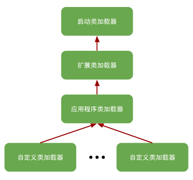

# 探究Java虚拟机如何载入程序——类加载机制
Java虚拟机把描述类地数据从Class文件加载到内存，并对数据进行校验、转换解析和初始化，最终形成可以被虚拟机直接使用的Java类型的过程称作虚拟机的类加载机制。

## 1. 类加载的时机
一个类型（类或接口）从被加载到虚拟机内存中开始，到卸载出内存为止，它的整个生命周期将会经历**加载**、**验证**、**准备**、**解析**、**初始化**、**使用**和**卸载**共7个阶段，其中验证、准备和解析三个部分统称为连接。

>加载、验证、准备、初始化和卸载这5个阶段的顺序是确定的，类型的加载必须按照这种顺序按部就班地开始，而解析阶段则不一定：它在某些情况下可以在初始化阶段之后再开始，这是为了支持Java语言的运行时绑定特性（也称动态绑定或晚期绑定）。

对于初始化阶段，《Java虚拟机规范》严格规定了有且只有6种情况必须立即对类进行“初始化”（而加载、验证、准备自然需要在此之前开始）：

（1）遇到`new`、`getstatic`、`putstatic`或`invokestatic`这四条字节码指令时，如果类型没有进行过初始化，则需要先触发其初始化阶段。能够生成这四条指令的典型Java代码场景有：
- 使用new关键字实例化对象
- 读取或设置一个类型的静态字段（被final修饰、已在编译期把结果放入常量池的静态字段除外）
- 调用一个类型的静态方法

（2）使用java.lang.reflect包的方法对类型进行反射调用的时候，如果类型没有进行初始化过，则需要先触发其初始化。

（3） 当初始化类的时候，如果发现其父类还没有进行过初始化，则需要先触发其父类的初始化。

>但是一个接口在初始化时，不要求去父接口全部都完成了初始化，只有在真正使用到父接口的时候（如引用接口中定义的常量）才会初始化。

（4）当虚拟机启动时，用户需要指定一个要执行的主类（包含main()方法的那个类），虚拟机会先初始化这个主类。

（5）当使用JDK 7新加入的动态语言支持时，如果一个java.lang.invoke.MethodHandle实例最后的解析结果为REF_getStatic、REF_putStatic、REF_invokeStatic、REF_newInvokeSpecial四种类型的方法句柄，并且这个方法句柄对应的类没有进行过初始化，则需要先触发其初始化。

（6）当一个接口中定义了JDK 8新加入的默认方法（被default关键字修饰的接口方法）时，如果有这个接口的实现类发生了初始化，那该接口要在其之前被初始化。

上述六种场景中的行为称为对一个类型进行主动引用。除此之外，所有引用类型的方式都不会触发初始化，称为被动引用，例如：
- 通过子类引用父类的静态字段，不会导致子类初始化。因为对于静态字段，只有直接定义这个字段的类才会被初始化。
- 通过数组定义来引用类，不会触发此类的初始化。
- 常量在编译阶段会存储调用类的常量池中，本质上没有直接引用到定义常量的类，因此不会触发定义常量的类的初始化。

## 2. 类加载的过程
### 2.1 加载
“加载”（Loading）阶段时整个“类加载”（Class Loading）过程中的一个阶段。在加载阶段，JVM需要完成三件事：
- （1）通过一个类的全限定名来获取定义此类的二进制字节流。
- （2）将这个字节流所代表的静态存储结构转化为方法区的运行时数据结构。
- （3）在内存中生成一个代表这个类的java.lang.Class对象，作为方法区这个类的各种数据的访问入口。

### 2.2 验证
验证是连接阶段的第一步，这一阶段的目的是确保Class文件的字节流中包含的信息符合《Java虚拟机规范》的全部约束要求，保证这些信息被当作代码运行后不会危害虚拟机的安全。

从整体上看，验证阶段大致会完成以下四个阶段的校验动作：文件格式验证、元数据验证、字节码验证和符号引用验证。
- 文件格式验证的目的是保证输入的字节流能正确地解析并存储于方法去之内，只有通过了这个阶段的验证之后，这段字节流才被允许进入JVM内存的方法区中存储，所以后面的三个验证阶段全部是基于方法区的存储结构上进行的，不会再直接读取和操作字节流了。
- 元数据验证的目的是对类的元数据信息进行语义校验，保证不存在与《Java语言规范》定义相悖的元数据信息。
- 字节码验证的目的是通过数据流分析和控制流分析，确定程序语义是合法的、符合逻辑的。
- 符号引用验证的目的是确保解析行为能正常执行。

### 2.3 准备
准备阶段是正式为类中定义的变量（即静态变量，被static修饰的变量）分配内存并设置类变量初始值的阶段，不包括实例变量（实例变量将会在对象实例化时随着对象一起分配在Java堆中）。

为类变量设置的初始值“通常情况”下是数据类型的零值，因为这个阶段还没有开始执行任何Java方法。例如一个类变量的定义为：“`public static int value = 123;`”，那么变量value在准备阶段过后的初始值为0而不是123，把value赋值为123的putstatic指令是程序被编译后存放于类构造器<clinit>()方法之中，所以把value赋值为123的动作要到类的初始化阶段才会被执行。

但是如果类字段的字段属性表中存在ConstantValue属性，那在准备阶段变量值就会被初始化为ConstantValue属性所指定的初始值。例如把上面类变量value的定义修改为：“`public static final int value = 123;`”，编译时javac将会为value生成ConstantValue属性，在准备阶段JVM就会根据ConstantValue的设置将value赋值为123。

### 2.4 解析
解析阶段是JVM将常量池内的符号引用替换为直接引用的过程。

符号引用以一组符号来描述所引用的目标，符号可以是任何形式的字面量，只要使用时能无歧义地定位到目标即可。符号引用在Class文件中以CONSTANT_Class_info、CONSTANT_Fieldref_info、CONSTANT_Methodref_info等类型的常量出现。直接引用是可以直接指向目标的指针、相对偏移量或者是一个能间接定位到目标的句柄。

解析动作主要针对类或接口、字段、类方法、接口方法、方法类型、方法句柄和调用点限定符这7类符号引用进行，分别对应于常量池的CONSTANT_Class_info、CONSTANT_Fieldref_info、CONSTANT_Methodref_info、CONSTANT_InterfaceMethodref_info、CONSTANT_MethodType_info、CONSTANT_MethodHandle_info、CONSTANT_Dynamic_info和CONSTANT_InvodeDynamic_info这8种常量类型。

### 2.5 初始化
类的初始化阶段是类加载过程的最后一步。在进行准备阶段，变量已经赋过一次系统要求的初始零值，而在初始化阶段，则会初始化类变量和其他资源。我们也可以从另外一种更直接的形式来表达：初始化阶段就是执行类构造器<clinit>()方法的过程。
- <clinit>()方法是由编译器自动收集类中的所有类变量的赋值动作和静态语句块（staic{}）中的语句合并产生的，编译器收集的顺序是由语句在源文件中出现的顺序决定的，静态语句块中只能访问到定义在静态语句块之前的变量，定义在它之后的变量，在前面的静态语句块可以赋值，但是不能访问。
- <clinit>()方法与类的构造函数不同，它不需要显式调用父类构造器，JVM会保证在子类的<clinit>()方法执行前，父类的<clinit>()方法已经执行完毕。因此在JVM中第一个被执行的<clinit>()方法的类型肯定是java.lang.Object。
- 由于父类的<clinit>()方法先执行，也就意味着父类中定义的静态语句块要优于子类的变量赋值操作。
- <clinit>()方法对于类或接口来说并不是必需的，如果一个类中没有静态语句块，也没有对变量的赋值操作，那么编译器可以不为这个类生成<clinit>()方法。
- 接口中虽然不能使用静态语句块，但仍然有变量初始化的赋值操作，因此接口与类一样都会生成<clinit>()方法。但接口与类不同的是，执行接口的<clinit>()方法不需要先执行父接口的<clinit>()方法，因为只有当父接口中定义的变量被使用时，父接口才会被初始化。此外，接口的实现类在初始化的时候也一样不会执行接口的<clinit>()方法。
- JVM必须保证一个类的<clinit>()方法在多线程环境中被正确地加锁同步，如果多个线程同时去初始化一个类，那么只会有其中一个线程去执行这个类的<clinit>()方法，其他线程都需要阻塞等待，知道活动线程执行完毕<clinit>()方法。

## 3. 类加载器
JVM设计团队有意把类加载阶段中的“通过一个类的全限定名来获取表述该类的二进制字节流”这个动作放到JVM外部去实现，以便让应用程序自己决定如何去获取所需的类。实现这个动作的代码被称为“类加载器”（ClassLoader）。

### 3.1 类与类加载器
对于任意一个类，都必须由加载它的类加载器和这个类本身一起共同确立其在JVM中的唯一性。每一个类加载器，都有其独立的类名称空间。也就是说，比价两个类是否“相等”，只有在这两个类是由同一个类加载器加载的前提下才有意义。

这里所指的“相等”，包括代表类的Class对象的equals()方法、isAssignableFrom()方法、isInstance()方法的返回结果，也包括了使用instanceof关键字做对象所属关系判定等各种情况。

### 3.2 双亲委派模型
站在JVM的角度来看，存在两种不同的类加载器：一种是使用C++语言实现的启动类加载器，它是虚拟机自身的一部分；另一种就是其他所有由Java语言实现的类加载器，它们独立于虚拟机外部，并全部继承自抽象类java.lang.ClassLoader。

从Java开发人员的角度来看，类加载器的划分就更细致一些。在JDK 8及之前版本中，Java一直保持着***三成类加载器、双亲委派*的类加载结构（尽管这套架构在JDK 9引入Java模块化系统之后有了一些调整变动，但依然未改变其主体结构）。对于这个时期的Java应用，绝大多数Java程序都会使用到以下3个系统提供的类加载器进行加载：
- **启动类加载器**（Bootstrap ClassLoader）：负责加载存放在`<JAVA_HOME>\lib`目录，或者被`-Xbootclasspath`参数所指定的路径中存放的，而且是JVM能够识别的类库加载到JVM内存中。启动类加载器无法被Java程序直接引用，开发者在编写自定义类加载器时，如果需要把加载请求委派给启动类加载器处理，那直接使用null代替即可。
- **扩展类加载器**（Extension ClassLoader）：这个类加载器是在类`sun.misc.Launcher$ExtClassLoader`中以Java代码的形式实现的，负责加载`<JAVA_HOME>\lib\ext`目录中，或者被`java.ext.dirs`系统变量所指定的路径中所有的类库。由于扩展类加载器是由Java代码实现的，开发者可以直接在程序中使用扩展类加载器来加载Class文件。
- **应用程序类加载器**（Application ClassLoader）：这个类加载器是由`sun.misc.Launcher$AppClassLoader`来实现的。由于应用程序类加载器是ClassLoader类中的`getSystemClassLoader()`方法的返回值，所以有时也被称作“系统类加载器”。它负责加载用户类路径（ClassPath）上所有的类库，开发者同样可以直接在代码中使用这个类加载器。如果应用程序中没有自定义过自己的类加载器，一般情况下这个就是程序中默认的类加载器。

为了更好地理解上述三个类加载器，可以查看`sun.misc.Launcher`源码，这是一个JVM的入口应用：
```java
public class Launcher {
    ...
    private static Launcher launcher = new Launcher();
    private static String bootClassPath = System.getProperty("sun.boot.class.path");
    ...

    public Launcher() {
        Launcher.ExtClassLoader var1;
        ...
        var1 = Launcher.ExtClassLoader.getExtClassLoader();
        ...
        this.loader = Launcher.AppClassLoader.getAppClassLoader(var1);
        ...

    }

    static class AppClassLoader extends URLClassLoader {
        final URLClassPath ucp = SharedSecrets.getJavaNetAccess().getURLClassPath(this);

        public static ClassLoader getAppClassLoader(final ClassLoader var0) throws IOException {
            final String var1 = System.getProperty("java.class.path");
            ...
        }
        ...
    }

    static class ExtClassLoader extends URLClassLoader {
        private static volatile Launcher.ExtClassLoader instance;

        public static Launcher.ExtClassLoader getExtClassLoader() throws IOException {
            if (instance == null) {
                Class var0 = Launcher.ExtClassLoader.class;
                synchronized(Launcher.ExtClassLoader.class) {
                    if (instance == null) {
                        instance = createExtClassLoader();
                    }
                }
            }

            return instance;
        }

        private static Launcher.ExtClassLoader createExtClassLoader() throws IOException {
            ...
            File[] var1 = Launcher.ExtClassLoader.getExtDirs();
            ...
            return new Launcher.ExtClassLoader(var1);
            ...
        }

        private static File[] getExtDirs() {
            String var0 = System.getProperty("java.ext.dirs");
            File[] var1;
            if (var0 != null) {
                StringTokenizer var2 = new StringTokenizer(var0, File.pathSeparator);
                int var3 = var2.countTokens();
                var1 = new File[var3];

                for(int var4 = 0; var4 < var3; ++var4) {
                    var1[var4] = new File(var2.nextToken());
                }
            } else {
                var1 = new File[0];
            }

            return var1;
        }

    }
}
```

可见，Launcher在其构造函数中初始化了ExtClassLoader和AppClassLoader。Launcher中并没有看见BootstrapClassLoader，但通过System.getProperty("sun.boot.class.path")得到了字符串bootClassPath，具体的内容为：
```
C:\Dev\Java\jdk1.8.0_231\jre\lib\resources.jar;
C:\Dev\Java\jdk1.8.0_231\jre\lib\rt.jar;
C:\Dev\Java\jdk1.8.0_231\jre\lib\sunrsasign.jar;
C:\Dev\Java\jdk1.8.0_231\jre\lib\jsse.jar;
C:\Dev\Java\jdk1.8.0_231\jre\lib\jce.jar;
C:\Dev\Java\jdk1.8.0_231\jre\lib\charsets.jar;
C:\Dev\Java\jdk1.8.0_231\jre\lib\jfr.jar;
C:\Dev\Java\jdk1.8.0_231\jre\classes;
```
可见，`System.getProperty("sun.boot.class.path")`得到的就是BootstrapClassLoader加载的类库路径。

而从ExtClassLoader的类定义中发现，它要加载的类库路径是通过`System.getProperty("java.ext.dirs")`获取的，其内容为：
```
C:\Dev\Java\jdk1.8.0_231\jre\lib\ext;
C:\WINDOWS\Sun\Java\lib\ext;
```

AppClassLoader要加载的类库路径则通过`System.getProperty("java.class.path")`获取，其内容为：
```
.;
C:\Dev\Java\jdk1.8.0_231\lib\dt.jar;
C:\Dev\Java\jdk1.8.0_231\lib\tools.jar;
```

> 上面的三组结果看着很眼熟，回顾一开始给电脑配置Java环境时设置的那三个环境变量，以前不明白，现在终于知道为什么了：
> - JAVA_HOME环境变量指的是JDK安装的位置，例如我的安装目录为：`C:\Dev\Java\jdk1.8.0_231\`；
> - PATH环境变量的作用是指定命令搜索路径，这样在命令行中直接键入命令即可执行，不用再键入它的全路径了。我们需要把jdk安装目录下的bin目录增加到现有的PATH变量中，bin目录中包含经常要用到的可执行文件如javac/java/javadoc等。例如我添加了：`%JAVA_HOME%\bin;%JAVA_HOME%\jre\bin;`，也就是在原来的PATH路径上添加JDK目录下的bin目录和jre目录的bin。
> - CLASSPATH环境变量的作用是指定类搜索路径，因为JVM就是通过CLASSPATH来寻找类的。我的设置如下：`CLASSPATH=.;%JAVA_HOME%\lib\dt.jar;%JAVA_HOME%\lib\tools.jar;`，其中
.代表的是当前目录。

前面提到了Java一直保持着三层类加载器、双亲委派的类加载架构。那么，什么是双亲委派呢？其实就是各种类加载器之间的层次关系，如下图所示：



双亲委派模型要求除了顶层的启动类加载器外，其余的类加载器都应该有自己的父类加载器。不过这里类加载器之间的父子关系一般不是以继承关系来实现的，而是通常使用组合关系来复用父加载器的代码。

双亲委派模型的工作过程是：如果一个类加载器收到了类加载的请求，它首先不会自己去尝试加载这个类，而是把这个请求委派给父类加载器去完成，每一个层次的类加载器都是如此，因此所有的加载请求最终都应该传送到最顶层额启动类加载器中，只有当父加载器反馈自己无法完成这个加载请求（它的搜索范围中没有找到相应的类）时，子加载器才会尝试自己去加载。

使用双亲委派模型来组织类加载器之间的关系，一个显而易见的好处就是Java中的类随着它的类加载器一起具备了一种带有优先级的层次关系。它的实现全部集中在`java.lang.ClassLoader`的`loadClass()`方法中：
```java
public abstract class ClassLoader {
    protected Class<?> loadClass(String name, boolean resolve) throws ClassNotFoundException
    {
        // 首先判断请求的类是否已经被加载
        Class<?> c = findLoadedClass(name);
        if (c == null) {
            try {
                if (parent != null) {
                    c = parent.loadClass(name, false);
                } else {
                    // 若父加载器为空则默认使用启动类加载器作为父加载器
                    c = findBootstrapClassOrNull(name);
                }
            } catch (ClassNotFoundException e) {
                // 如果父类加载器抛出ClassNotFoundException，则说明父类加载器无法完成加载请求
            }

            if (c == null) {
                // 在父类加载器无法加载时再调用自身的findClass方法进行类加载
                c = findClass(name);
            }
        }
        if (resolve) {
            resolveClass(c);
        }
        return c;
    }
}
```
这段代码的逻辑非常清晰：先检查请求加载的类型是否已经被加载过，若没有则调用父加载器的`loadClass()`方法，若父加载器为空则默认使用启动类加载器作为父加载器。假如父类加载器加载失败，抛出ClassNotFoundException异常的话，才调用自己的findClass()方法尝试进行加载。
